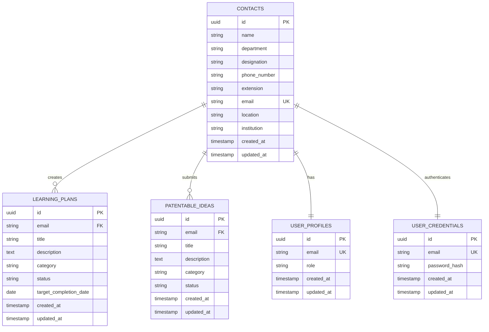

# ACTREC Telephone Directory - Design Document

## 1. Overview

The ACTREC Telephone Directory is a role-based contact management system designed for the Advanced Centre for Treatment, Research, and Education in Cancer (ACTREC). The system provides a centralized directory for employee contacts along with extended features for learning plans and patentable ideas management.

### 1.1 Purpose
This document provides a comprehensive overview of the system architecture, database design, and implementation details of the ACTREC Telephone Directory application.

### 1.2 Scope
The system includes:
- Contact directory management
- Role-based access control (RBAC)
- User authentication and management
- Learning plans tracking
- Patentable ideas submission
- Reporting and analytics
- Public search capabilities

## 2. System Architecture

### 2.1 Technology Stack
- **Frontend**: Next.js 14, React, TypeScript, Tailwind CSS
- **Backend**: Supabase PostgreSQL database
- **Authentication**: Custom JWT-based system with database integration
- **UI Components**: Shadcn/ui with Radix UI primitives
- **State Management**: React Context API
- **Styling**: Tailwind CSS with custom themes

### 2.2 High-Level Architecture
```
┌─────────────────┐    ┌──────────────────┐    ┌────────────────────┐
│   Frontend      │    │   Authentication │    │   Database         │
│   (Next.js)     │◄──►│   (Custom JWT)   │◄──►│   (Supabase)       │
└─────────────────┘    └──────────────────┘    └────────────────────┘
         │                        │                       │
         ▼                        ▼                       ▼
┌─────────────────┐    ┌──────────────────┐    ┌────────────────────┐
│   UI Layer      │    │   API Layer      │    │   Data Layer       │
│   (React)       │    │   (Next.js API)  │    │   (PostgreSQL)     │
└─────────────────┘    └──────────────────┘    └────────────────────┘
```

## 3. Database Design

### 3.1 Entity Relationship Diagram



### 3.2 Database Tables

#### 3.2.1 Contacts Table
Stores employee contact information.

```sql
CREATE TABLE contacts (
    id UUID DEFAULT uuid_generate_v4() PRIMARY KEY,
    name TEXT NOT NULL,
    department TEXT NOT NULL,
    designation TEXT NOT NULL,
    phone_number TEXT,
    extension TEXT NOT NULL,
    email TEXT NOT NULL UNIQUE,
    location TEXT NOT NULL,
    institution TEXT NOT NULL DEFAULT 'ACTREC',
    created_at TIMESTAMP WITH TIME ZONE DEFAULT NOW(),
    updated_at TIMESTAMP WITH TIME ZONE DEFAULT NOW()
);
```

#### 3.2.2 User Profiles Table
Stores user roles and permissions.

```sql
CREATE TABLE user_profiles (
    id UUID DEFAULT uuid_generate_v4() PRIMARY KEY,
    email TEXT UNIQUE NOT NULL,
    role TEXT NOT NULL DEFAULT 'regular' CHECK (role IN ('admin', 'regular')),
    created_at TIMESTAMP WITH TIME ZONE DEFAULT NOW(),
    updated_at TIMESTAMP WITH TIME ZONE DEFAULT NOW()
);
```

#### 3.2.3 User Credentials Table
Stores user authentication credentials.

```sql
CREATE TABLE user_credentials (
    id UUID DEFAULT uuid_generate_v4() PRIMARY KEY,
    email TEXT UNIQUE NOT NULL,
    password_hash TEXT NOT NULL,
    created_at TIMESTAMP WITH TIME ZONE DEFAULT NOW(),
    updated_at TIMESTAMP WITH TIME ZONE DEFAULT NOW()
);
```

#### 3.2.4 Learning Plans Table
Stores user learning and development plans.

```sql
CREATE TABLE learning_plans (
    id UUID DEFAULT uuid_generate_v4() PRIMARY KEY,
    email TEXT NOT NULL,
    title TEXT NOT NULL,
    description TEXT NOT NULL,
    category TEXT NOT NULL,
    status TEXT NOT NULL DEFAULT 'not-started' CHECK (status IN ('not-started', 'in-progress', 'completed', 'archived')),
    target_completion_date DATE,
    created_at TIMESTAMP WITH TIME ZONE DEFAULT NOW(),
    updated_at TIMESTAMP WITH TIME ZONE DEFAULT NOW()
);
```

#### 3.2.5 Patentable Ideas Table
Stores research ideas and patent submissions.

```sql
CREATE TABLE patentable_ideas (
    id UUID DEFAULT uuid_generate_v4() PRIMARY KEY,
    email TEXT NOT NULL,
    title TEXT NOT NULL,
    description TEXT NOT NULL,
    category TEXT,
    status TEXT NOT NULL DEFAULT 'draft' CHECK (status IN ('draft', 'under-review', 'approved', 'filed', 'granted')),
    created_at TIMESTAMP WITH TIME ZONE DEFAULT NOW(),
    updated_at TIMESTAMP WITH TIME ZONE DEFAULT NOW()
);
```

## 4. Supabase Cloud Deployment

### 4.1 Migration Scripts Order
Apply the following migration scripts in order:

1. `20250917004000_init_schema.sql` - Initial schema setup
2. `20250917010000_add_contact_triggers.sql` - Contact triggers
3. `20250918000000_add_sync_triggers.sql` - Sync triggers
4. `20250919000000_enhanced_contact_triggers.sql` - Enhanced triggers
5. `20250919000002_fix_ideas_and_plans.sql` - Fix ideas and plans
6. `20250929000000_add_status_to_patentable_ideas.sql` - Add status to ideas
7. `20250930000000_add_id_columns.sql` - Add ID columns
8. `20251007000000_fix_rls_policies.sql` - Fix RLS policies
9. `20251024000001_add_target_completion_date_to_learning_plans.sql` - Add target date
10. `20251113000000_allow_anon_read_access.sql` - Allow anon access
11. `20251202000000_make_phone_optional.sql` - Make phone optional
12. `20251203000000_comprehensive_rls_policies.sql` - Comprehensive RLS

### 4.2 Row Level Security (RLS) Policies

#### Contacts Table Policies
```sql
-- Authenticated users can view contacts
CREATE POLICY "Authenticated users can view contacts" ON contacts
    FOR SELECT TO authenticated USING (true);

-- Admins can insert contacts
CREATE POLICY "Admins can insert contacts" ON contacts
    FOR INSERT TO authenticated 
    WITH CHECK (EXISTS (
        SELECT 1 FROM user_profiles 
        WHERE id = auth.uid() AND role = 'admin'
    ));

-- Admins can update contacts
CREATE POLICY "Admins can update contacts" ON contacts
    FOR UPDATE TO authenticated 
    USING (EXISTS (
        SELECT 1 FROM user_profiles 
        WHERE id = auth.uid() AND role = 'admin'
    ));

-- Admins can delete contacts
CREATE POLICY "Admins can delete contacts" ON contacts
    FOR DELETE TO authenticated 
    USING (EXISTS (
        SELECT 1 FROM user_profiles 
        WHERE id = auth.uid() AND role = 'admin'
    ));
```

#### Learning Plans Table Policies
```sql
-- Authenticated users can view learning plans
CREATE POLICY "Authenticated users can view learning_plans" ON learning_plans
    FOR SELECT TO authenticated USING (true);

-- Authenticated users can insert learning plans
CREATE POLICY "Authenticated users can insert learning_plans" ON learning_plans
    FOR INSERT TO authenticated WITH CHECK (true);

-- Authenticated users can update learning plans
CREATE POLICY "Authenticated users can update learning_plans" ON learning_plans
    FOR UPDATE TO authenticated USING (true);

-- Authenticated users can delete learning plans
CREATE POLICY "Authenticated users can delete learning_plans" ON learning_plans
    FOR DELETE TO authenticated USING (true);

-- Anonymous users can view learning plans
CREATE POLICY "Anonymous users can view learning_plans" ON learning_plans
    FOR SELECT TO anon USING (true);
```

#### Patentable Ideas Table Policies
```sql
-- Authenticated users can view patentable ideas
CREATE POLICY "Authenticated users can view patentable_ideas" ON patentable_ideas
    FOR SELECT TO authenticated USING (true);

-- Authenticated users can insert patentable ideas
CREATE POLICY "Authenticated users can insert patentable_ideas" ON patentable_ideas
    FOR INSERT TO authenticated WITH CHECK (true);

-- Authenticated users can update patentable ideas
CREATE POLICY "Authenticated users can update patentable_ideas" ON patentable_ideas
    FOR UPDATE TO authenticated USING (true);

-- Authenticated users can delete patentable ideas
CREATE POLICY "Authenticated users can delete patentable_ideas" ON patentable_ideas
    FOR DELETE TO authenticated USING (true);

-- Anonymous users can view patentable ideas
CREATE POLICY "Anonymous users can view patentable_ideas" ON patentable_ideas
    FOR SELECT TO anon USING (true);
```

## 5. Authentication System

### 5.1 Login Process
1. User submits email and password
2. Credentials validated against `user_credentials` table
3. User profile fetched from `user_profiles` table
4. JWT token generated with user information
5. Token sent to client for session management

### 5.2 Password Security
Passwords are stored as plaintext in the database for simplicity in this implementation. In a production environment, passwords should be securely hashed using bcrypt or similar.

### 5.3 Role-Based Access Control
- **Admin Users**: Full access to all features including contact management, user administration, and system reports
- **Regular Users**: Limited access to view contacts, manage their own learning plans and patentable ideas

## 6. Key Features

### 6.1 Contact Management
- Single contact addition with automatic user account creation
- Bulk contact upload via CSV with automatic credential generation
- Contact search and filtering capabilities
- Public search access without authentication

### 6.2 User Management
- Role assignment (admin/regular)
- Password reset functionality
- User deletion with safety checks
- Bulk user operations

### 6.3 Learning Plans
- Create, read, update, delete learning plans
- Status tracking (not-started, in-progress, completed, archived)
- Category organization
- Target completion dates

### 6.4 Patentable Ideas
- Submit and manage research ideas
- Status tracking (draft, under-review, approved, filed, granted)
- Category organization
- Public visibility for transparency

### 6.5 Reporting and Analytics
- User statistics by role
- Contact distribution by department
- Learning plan progress tracking
- Patentable idea metrics

## 7. Deployment Instructions

### 7.1 Environment Setup
1. Create a new Supabase project
2. Configure environment variables in `.env.local`:
   ```
   NEXT_PUBLIC_SUPABASE_URL=your_supabase_url
   NEXT_PUBLIC_SUPABASE_ANON_KEY=your_anon_key
   SUPABASE_SERVICE_ROLE_KEY=your_service_role_key
   ```

### 7.2 Database Initialization
1. Apply migration scripts in order:
   ```bash
   npx supabase link --project-ref your-project-ref
   npx supabase db push
   ```

### 7.3 Application Deployment
1. Install dependencies:
   ```bash
   npm install
   ```
2. Build the application:
   ```bash
   npm run build
   ```
3. Start the production server:
   ```bash
   npm start
   ```

## 8. Security Considerations

### 8.1 Data Protection
- Row Level Security (RLS) policies enforce data access restrictions
- Service role keys used for backend operations only
- Anonymous read access enabled for public features

### 8.2 Admin Protection
- System administrator account cannot be deleted
- Last administrator protection prevents orphaned admin roles
- Confirmation dialogs for destructive operations

### 8.3 Session Management
- JWT tokens with 24-hour expiration
- Client-side storage with automatic cleanup
- Secure token transmission over HTTPS

## 9. Future Enhancements

### 9.1 Planned Features
- Password hashing for improved security
- Email notifications for user actions
- Advanced reporting dashboards
- Mobile-responsive improvements
- Multi-language support

### 9.2 Scalability Considerations
- Database indexing for improved query performance
- Pagination for large dataset handling
- Caching strategies for frequently accessed data
- Load balancing for high-traffic scenarios